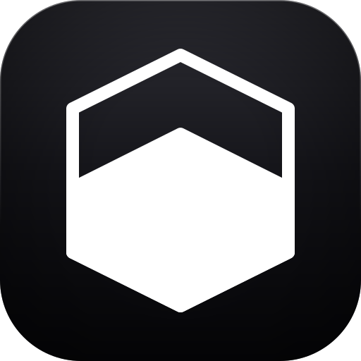
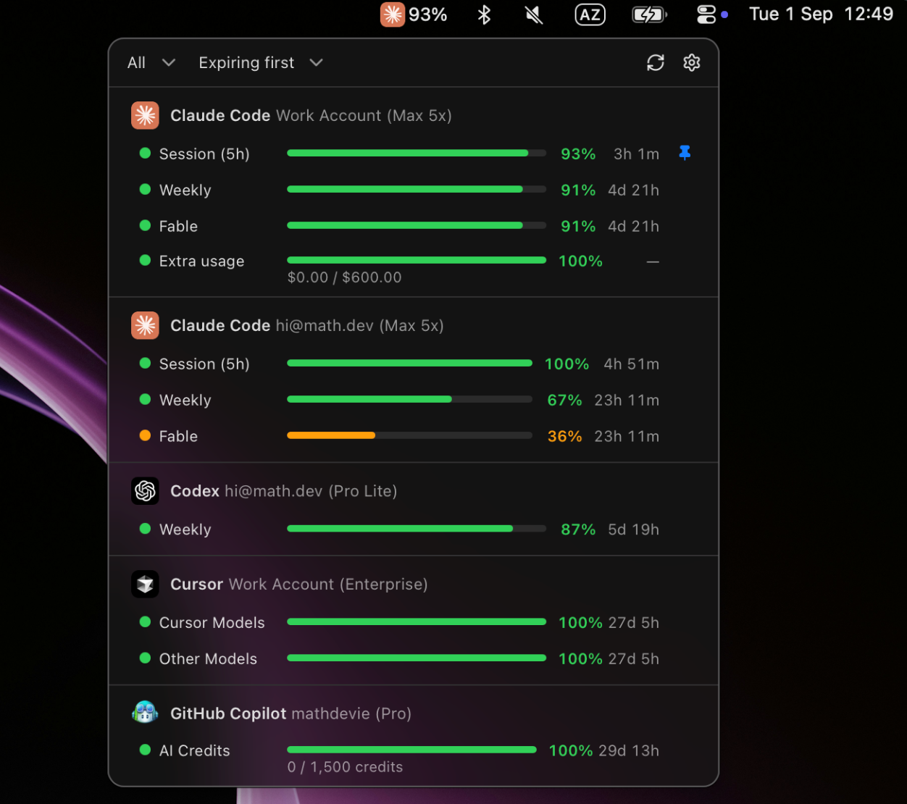

# Devie AI Quota Tracker

Devie AI Quota Tracker is a local macOS menu bar app for AI subscription quotas.

It keeps separate Claude, Codex, Gemini CLI, GitHub Copilot, and Cursor
accounts in one place: sign in once per account, see every quota window and
its reset time from the menu bar, and get notified before a limit hits.
There is no Devie account, cloud database, proxy, or hosted backend — all
data stays on the Mac.

<!--
Screenshots: put the images in docs/screenshots/ and uncomment.
Suggested shots: the menu bar popover and the main Quota window,
each in light and dark.

| Menu bar popover | Main window |
| --- | --- |
|  |  |
-->

## Install

1. [**Download Devie AI Quota Tracker for Apple silicon (DMG)**](https://cdn.crabnebula.app/download/mathdev/devie-quota/latest/platform/dmg-aarch64)
2. Open the DMG and drag **Devie AI Quota Tracker** to Applications.
3. Launch it and add an account under **Providers**.

All versions are listed on the
[CrabNebula Cloud releases page](https://web.crabnebula.cloud/mathdev/devie-quota/releases).
Builds are signed and notarized for Apple silicon. The app updates itself;
see [docs/updates.md](docs/updates.md).

## Features

- A macOS menu bar item with the provider logo and percent left, plus a
  popover; pin any quota window to the menu bar.
- A native-style window with a sidebar: Quota, Providers, Settings.
- In-app OAuth sign-in for Claude, Codex, Gemini CLI, GitHub Copilot, and
  Cursor — any number of accounts per provider.
- Manual refresh and an automatic five-minute refresh loop; a failed
  refresh keeps the last good snapshot and shows it as "Stale".
- Quota alerts: low quota, reset soon, and reset happened.
- Local SQLite storage for connections, identities, and snapshots.
- Three native appearances (Light, Dark, System) and eight custom themes.
- Fifteen interface languages.

## Provider support

| Provider | Sign-in | Quota source |
| --- | --- | --- |
| Claude | Claude Code OAuth client, PKCE, callback on `localhost:54545` (or a pasted code) | `api.anthropic.com/api/oauth/usage` |
| Codex | Codex CLI OAuth client, PKCE, callback on `localhost:1455` | `chatgpt.com/backend-api/wham/usage` |
| Gemini CLI | Gemini CLI OAuth client and a dynamic loopback callback | `cloudcode-pa.googleapis.com/v1internal:retrieveUserQuota` |
| GitHub Copilot | GitHub device code flow with the Copilot client id | `api.github.com/copilot_internal/user` |
| Cursor | Cursor desktop PKCE deep link (`cursor.com/loginDeepControl`), polled on `api2.cursor.sh/auth/poll`, no callback port | `cursor.com/api/usage-summary` |

Claude usage reads share one cache: a read stays fresh for five minutes on
the timer (a refresh button always fetches), one request per token runs at
a time, a `429` pauses the endpoint for three minutes, and a failed read
shows the last good data as "Stale".

## Privacy and security

- Devie AI Quota Tracker has no product login or remote application database.
- Provider quota checks can contact Anthropic, Google, OpenAI, or GitHub.
- Each OAuth account is a separate connection. Tokens live in one private
  file per connection with `0600` permissions, under
  `~/Library/Application Support/com.devie.quota/credentials/`. Removing
  an account deletes its token file.
- Provider tokens never enter the React webview. SQLite stores neither
  tokens nor complete provider responses.
- The app owns the tokens for every sign-in and never reads or changes the
  CLI logins on this Mac.
- Anonymous usage events and crash reports go to PostHog (EU). They carry
  a random id, the app version, the OS, and the locale. They never include
  account names, tokens, quota numbers, or labels. Turn this off in
  Settings → Privacy. Builds without `POSTHOG_API_KEY` send nothing.

The local database is stored at
`~/Library/Application Support/com.devie.quota/devie-quota.sqlite3`.

## Architecture

```text
Next.js static interface
        |
        | narrow Tauri commands and quota events
        v
Tauri and Rust core
  |-- provider OAuth sign-ins and token renewal
  |-- direct provider quota requests
  |-- quota normalization and refresh scheduling
  |-- SQLite state and quota history
  `-- macOS menu bar and windows
```

Rust owns network requests, SQLite, and the menu bar. The webview receives
normalized connection and quota values only.

The main folders are:

```text
src/                    Next.js interface and application components
src/ui/                 Byte-identical mirror of the Devie UI src/ui folder
src/theme/              App theme registry, native appearances, custom themes
src-desktop/            Tauri application and Rust core
src-desktop/src/oauth/  Provider sign-in and quota adapters
docs/                   Build, signing, update, and history documentation
```

`src/ui` is a byte-identical copy of the `src/ui` folder from
[Devie UI](https://www.devie-ui.com/), and a sync is a plain rsync. Do not
edit or delete files inside it. Every customization lives outside the
mirror: application components in `src/components`, the theme registry and
native appearances in `src/theme`, and global styles in `src/app`.

## Development

Read [CONTRIBUTING.md](CONTRIBUTING.md) for the prerequisites, the
development commands, the project rules, and the pull request checklist.

## Forking

A fork that ships its own builds must replace these project-specific values:

- The bundle identifier `com.devie.quota` in `src-desktop/tauri.conf.json`.
- The CrabNebula Cloud slug `mathdev/devie-quota` in the updater endpoint
  (`src-desktop/src/updater.rs`) and in the release workflow.
- The updater `pubkey` in `src-desktop/tauri.conf.json`, together with the
  matching private signing key.
- The Apple signing and notarization secrets in the GitHub `Release`
  environment (see [the macOS signing guide](docs/macos-signing.md)).

Without these changes a fork would collide with the upstream bundle id and
query an updater feed it cannot publish to.

## Credits and license

Devie AI Quota Tracker is released under the [MIT License](LICENSE). See
[NOTICE.md](NOTICE.md) for third-party attribution.

The design combines useful ideas from these projects:

- [Devie UI](https://www.devie-ui.com/) for components, tokens, and themes.
- [AIUsage](https://github.com/sylearn/AIUsage) for the quota dashboard scope.
- [CodexBar](https://github.com/steipete/CodexBar) for menu bar and provider-source patterns.
- [usage4claude](https://github.com/f-is-h/usage4claude) for a compact menu bar presentation.
- [9router](https://github.com/decolua/9router) for multi-account provider concepts.
