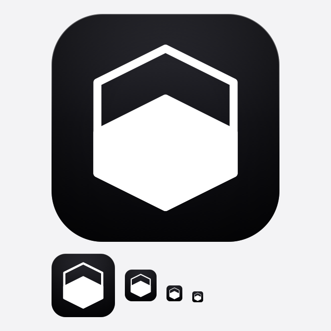

# App icon



The mark is a pointy-top hexagon shell with a chevron-topped fill. The fill
level reads as a quota gauge, and its peak echoes the shell's peak. It sits on
the geometric centre of the 512px canvas.

The plate is top-lit (`#2e2e35` → `#07070a`), vignetted at the corners, and
carries a 3px rim highlight along the top edge, so the icon reads with depth
rather than as flat black.

`generate.py` is the single source of truth for the geometry and the plate
treatment. It also renders `preview.png`, which shows the icon down to 22px —
the menu-bar size, and the one that decides whether a treatment survives.

## Regenerating

```sh
python3 docs/logo/generate.py
cp docs/logo/app-icon.svg src-desktop/icons/app-icon.svg
cp docs/logo/app-icon.svg src/app/icon.svg
bun tauri icon src-desktop/icons/app-icon.svg
```

`tauri icon` rewrites the macOS `.icns`, the Windows `.ico`, and the PNG, iOS
and Android sets under `src-desktop/icons/`.
