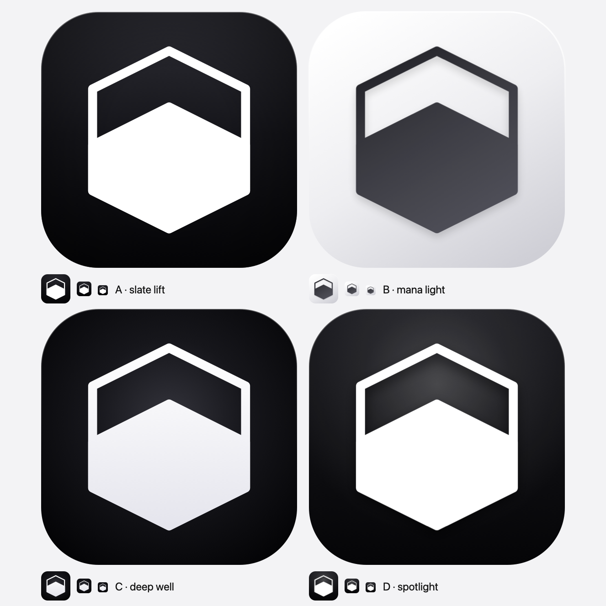
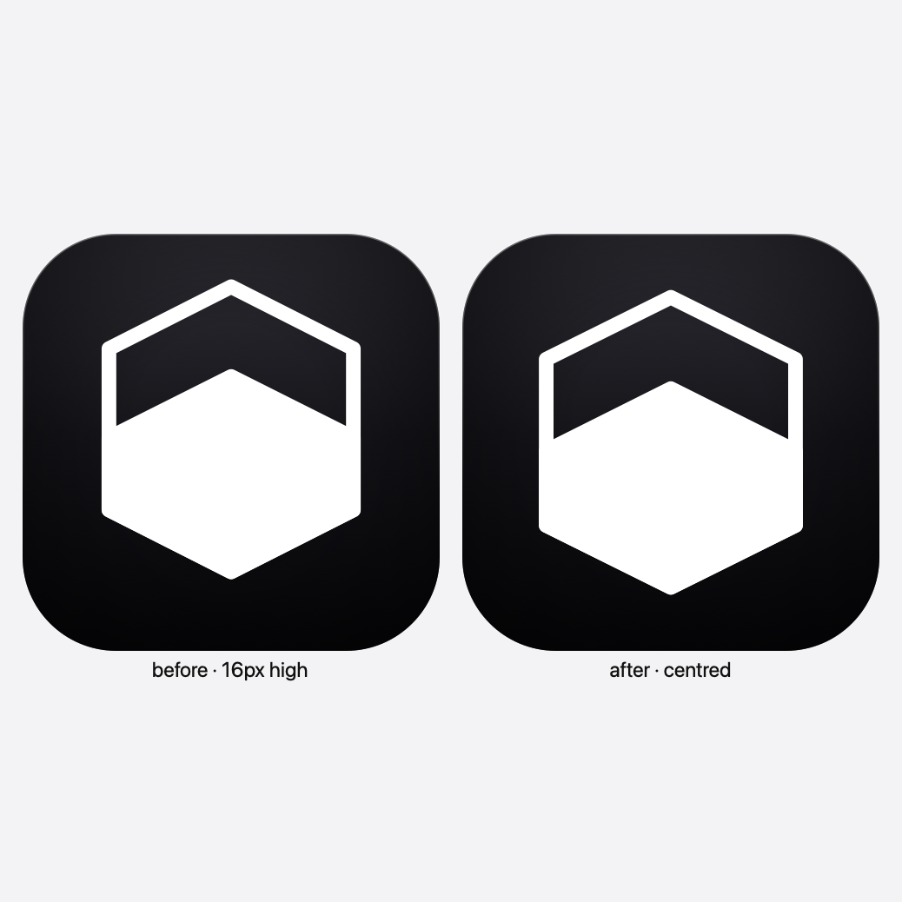

# App icon

The mark is a pointy-top hexagon shell with a chevron-topped fill. The fill
level reads as a quota gauge, and its peak echoes the shell's peak.

`generate.py` is the single source of truth for the geometry and for the four
depth treatments. It also renders the preview sheets below.

```sh
python3 docs/logo/generate.py
```

## Variants



| Variant | Plate | Depth cue | Mark |
| --- | --- | --- | --- |
| **A · slate lift** (live) | `#2e2e35` → `#07070a`, vertical | top-lit gradient, corner vignette, 3px top rim | pure white |
| **B · mana light** | `#ffffff` → `#cfcfd6`, diagonal | soft cast shadow under the mark | `#202025` → `#51515a` |
| **C · deep well** | radial, lit at the centre | the light reads as coming from behind the mark | `#ffffff` → `#e5e5ed` |
| **D · spotlight** | `#1a1a1f` → `#050507` | spotlight from the top, plus a drop shadow under the mark | pure white |

Each cell also shows the icon at 64px, 32px and 22px, which is the size that
decides whether a treatment survives in the menu bar and the Dock.

## Centring

The first pass placed the mark 16px high: a 65px gap above against a 97px gap
below. It now sits on the geometric centre and is 2% larger.



## Switching variant

```sh
cp docs/logo/variant-d-spotlight.svg src-desktop/icons/app-icon.svg
cp docs/logo/variant-d-spotlight.svg src/app/icon.svg
bun tauri icon src-desktop/icons/app-icon.svg
```
