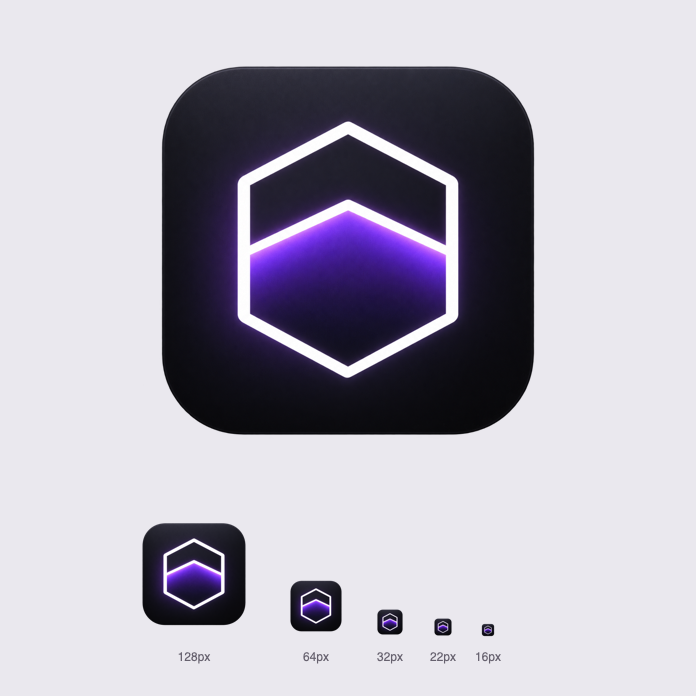

# App icon



The **Light level** icon keeps the pointy-top hexagon and chevron quota
boundary. White outlines surround a violet light field that fades toward
the bottom of the gauge. The matte charcoal plate, fine grain, and local
glow follow the Devie shaders Light seams style and the approved Devie Code
icon.

[master.png](master.png) is the selected 1254 × 1254 raster artwork. It
preserves the approved mark, light, and texture. The built-in image
generator produced it in edit mode; the [exact prompt](prompt.md) records
the design inputs. Asset generation never calls an image service or
redraws the mark.

[app-icon.png](app-icon.png) is the generated 1024 × 1024 source for all
exports. The exporter scales the full master to 915px and centers it on a
transparent canvas. Combined with the master's existing border, the visible
plate occupies about 81% of the canvas, matching the Devie Code icon.

## Regenerating

On macOS, with Bun dependencies installed:

```sh
python3 docs/logo/generate.py
```

The script uses the local Tauri CLI in a temporary directory. It first
generates `app-icon.png` from an SVG wrapper around the raster master, then
exports only the app's macOS assets into `src-desktop/icons/`:

- `32x32.png`
- `128x128.png`
- `128x128@2x.png`
- `icon.icns`
- `icon.png`

The browser favicon at `src/app/icon.png` is an identical copy of the
128px native export. The README uses `docs/logo/app-icon.png`. The former
SVG sources are removed so they cannot restore the old white-fill design.
Quick Look renders the size preview. No additional Python packages are
required.

The no-quota menu-bar state uses the app's default icon. When a provider is
selected, the menu bar continues to use that provider's icon and percentage.
Provider logos and quota-status colors are independent of this app artwork.
